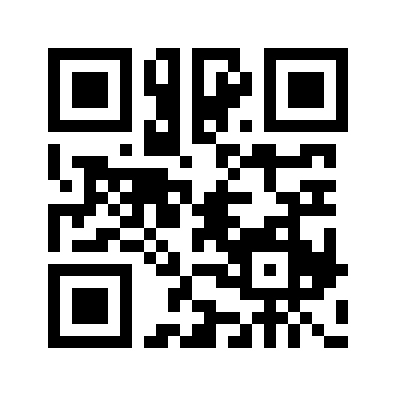

# Commissioning & HA Setup

Get a flashed unit into Home Assistant, with **no cloud**. The ESPHome build is *adopted* over the
ESPHome API; the two Matter builds (ESP32 and AmebaZ2) are *commissioned* through
`python-matter-server`.

## ESPHome build: adopt it

No commissioning, no matter-server, no pairing code.

1. **Get it on Wi-Fi.** The node joins the network in `firmware/esphome/secrets.yaml`. If it cannot
   (wrong password, different network), it opens a hotspot named **`hisense-ac-setup`** after about a
   minute. Join it from a phone; the captive portal asks for your Wi-Fi and the node reboots onto it.
2. **Add it in Home Assistant.** HA discovers the node over mDNS: Settings → Devices & Services shows
   a discovered **ESPHome** device. Select **Configure** and paste the API encryption key, the
   `hisense_ac__encryption_key` value from your `secrets.yaml`.
3. **Not discovered?** Add it by hand: Settings → Devices & Services → **Add Integration** →
   **ESPHome**, host `hisense-ac.local` or the node's IP address, port `6053`.

The device appears as **Air Conditioner** with the climate entity and every switch, sensor and fault
flag; see [Everyday Control](Everyday-Control#esphome-build). The API is plain TCP, so an A/C on a
separate IoT VLAN only needs HA allowed to reach port 6053 and the node added by IP; the IPv6 mDNS
problem below does not apply.

To change the key later, edit `secrets.yaml`, re-flash (over the air is fine), then update the key in
HA when it reports the node as needing re-authentication.

## Matter builds: commission them

Commissioning is local (BLE + Wi-Fi) and runs through `python-matter-server` on your Home Assistant
host (commonly a Raspberry Pi). The steps are the same for the ESP32 Matter build and the AmebaZ2
module.

Depth: `reverse-engineering/docs/02-matter-local-control.md`.

## Credentials (CSA test defaults)

The firmware ships the standard Matter **test** credentials: dev-only, uncertified. The values
below are the repo's default test creds; if you change the credentials in your build, your pairing
code and QR differ.

| Field | Value |
|---|---|
| Manual pairing code | `3497-011-2332` (`34970112332`), your build's pairing code |
| Discriminator | 3840 (0x0F00) |
| Passcode | 20202021 |
| VID / PID | `0xFFF1` / `0x8001` |



*Default test-credential QR (pairing `3497-011-2332`). Your build's QR differs if you change credentials.*

## Open the pairing window

On the A/C remote, press the **"Horizon Airflow" (swing) button 6 times** → the buzzer beeps and
the display shows **"77"**. The module clears its stored SSID/password, re-enters pairing, and opens
the Matter commissioning window. (Wired-remote alternative: **"Sleep" 8 times**.) The Matter
interface is un-commissioned/dormant from the factory, so a fresh reset guarantees an open
window. See the doc for the firmware evidence.

## Commission into Home Assistant

1. Run `python-matter-server` on the LAN (e.g. `ghcr.io/home-assistant-libs/python-matter-server`,
   host-networked, D-Bus mounted for BLE). It runs on your Home Assistant host (commonly a
   Raspberry Pi), not localhost.
2. **Enable test-net DCL.** The device uses *test* attestation certs, so a default server rejects it
   (`AttestationVerification` failure). Start the server with `--enable-test-net-dcl` so it trusts
   the CSA **Test** PAA roots.
3. HA → Settings → Devices & Services → **Matter** → point at the server (`ws://<host>:5580/ws`).
4. **Add device** → enter `34970112332` (or scan the QR). Accept the "uncertified device" warning.
5. Commissioning uses **BLE**, so the controller must be in Bluetooth range of the A/C.

python-matter-server assigns each commissioned unit its own node ID. Note yours after commissioning
(it is what later `read_attribute` / `update_node` calls target). If you commission a second unit it
gets its own separate node ID.

## Cross-VLAN mDNS gotcha

Matter operational discovery **and** transport are **IPv6-only**; discovery is mDNS, and neither
crosses VLANs by default. If the A/C is on an isolated IoT VLAN and your Home Assistant host is on a
different VLAN, the node commissions but then goes `available=False`. CASE can't reach it. A
router/AP mDNS reflector typically does **not** reflect IPv6 mDNS across VLANs, so that isn't the
fix.

**Working fix: put the controller on the A/C's L2** (dual-home the host onto the A/C's VLAN):

1. On the host's switch port, add the **A/C VLAN tagged** (keep the host's own VLAN native/untagged).
2. Add a persistent IPv6-only VLAN sub-interface via NetworkManager (no `dhclient`, it hangs on a
   sub-iface). Substitute your interface name and the A/C's VLAN ID for `eth0` / `4`:
   ```
   nmcli con add type vlan con-name iot4 dev eth0 id 4 \
       ipv4.method disabled ipv6.method auto ipv6.addr-gen-mode eui64 \
       connection.autoconnect yes
   nmcli con up iot4
   ```
   → `eth0.4` gets a SLAAC address on the A/C's VLAN, survives reboot.
3. `docker restart matter-server` so CHIP's mDNS resolver binds the sub-interface. The node becomes
   `available=True` within ~15 s.

Trust direction stays correct: the A/C is isolated on IoT; only the Matter controller reaches in.

## Re-interview after a structure-changing OTA

HA builds entities from the node structure at setup and caches it. After an OTA that adds or removes
endpoints/clusters, the new entities don't appear until a **node re-interview**. The OTA `flash`
step (`dev.py ota <target> flash`, also run by `release --flash`) auto-calls `interview_node` on success; if entities still lag, reload the Matter integration
(Settings → Devices & Services → **Matter** → ⋮ → **Reload**). See [OTA Updates](OTA-Updates).
