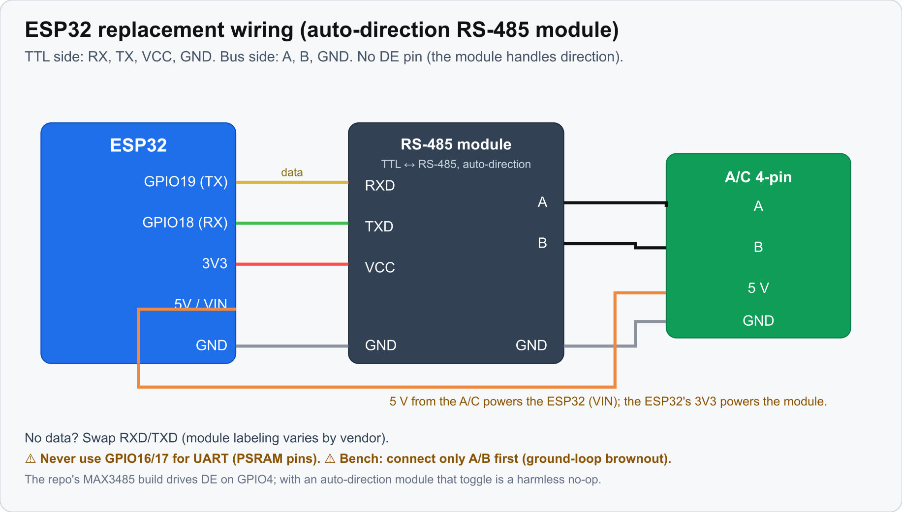

# ESP32 Replacement Build

The second firmware track: an **ESP32 + RS-485 transceiver** that replaces the AmebaZ2 module,
reusing the driver unchanged. Source + full detail: `firmware/esp32-matter/README.md`.

← back to [Home](Home) · siblings: [Repo Map and Build Pipeline](Repo-Map-and-Build-Pipeline) ·
[Protocol Overview](Protocol-Overview) · [Testing and QA](Testing-and-QA)

---

## Why it exists

The W41H1 (RTL8710C) modules **die easily** (ESD / handling, a dead module is a common
failure) and are **hard to source in the EU**. The *protocol* is the hard part, and it's already
done and validated. An ESP32 that speaks the same bus bytes **is** a W41H1 to the mainboard:
there is no Hisense auth on the wire, only the RS-485 handshake the driver already emulates. So
this track swaps the radio/SoC and keeps the driver.

## The driver is the shared heart (reused UNCHANGED)

The ESP32 app **compiles the AmebaZ2 driver directly**. Its CMake pulls in
`../../../src/rs485-driver/hisense_rs485.cpp` (compile-time coupling, not a fork). Do not fork
these:

| File | Role |
|---|---|
| `../src/rs485-driver/hisense_rs485.{h,cpp}` | codec + bus task + DE half-duplex + "77" handler; **compiles as-is** against the HAL shim |
| `../src/rs485-driver/matter_aircon_map.h` | Matter↔Hisense mapping (host-tested) |
| `../src/rs485-driver/power_estimate.h` | power estimate (clamped) |
| `../test/virtual_ac.py`, `../test/*` | bench simulator + host tests; develop against these first |

Because the driver is the same file both firmwares build, protocol fixes land once and both
tracks get them. See [Protocol Overview](Protocol-Overview).

## The HAL-shim model

The **only** platform-specific glue is `components/hisense_hal/`, an ESP-IDF implementation of
the **same** mbed-style `serial_*` / `gpio_*` surface the driver's host-test stubs define
(`../test/hal_stub.h`). Swap the HAL, keep the driver.

```
Hisense mainboard ──RS-485(A/B)── RS-485 module ──UART── ESP32 ── Matter/Wi-Fi ── Home Assistant
                                                            │
                                  (hisense_rs485.cpp, unchanged)
                                    matter_aircon_map.h ────┘→ esp-matter Thermostat+FanControl
```

`hisense_hal` presents `serial_api.h` / `gpio_api.h` / `PinNames.h` / `platform_stdlib.h` +
FreeRTOS shims so the driver's `#include`s resolve. RX is a "soft IRQ": a task blocks on the
UART event queue and calls the driver's registered `RxIrq` handler, which drains via
`serial_readable()` / `serial_getc()`, the identical contract to AmebaZ2. `main/` is the esp-matter
app: it registers the callbacks (recommission, status uplink) and maps cluster reads/writes
through `matter_aircon_map.h`. Validated on a classic **ESP32-D0WDQ6**; esp32c3/s3 also work.

## BOM (~€5) + wiring

- **ESP32-C3** dev board (Wi-Fi+BLE, spare UART, Matter-capable). 5 V on VIN.
- A **3.3 V RS-485 module.** The simplest is an **auto-direction** TTL↔RS-485 module: wire
  RX/TX/VCC/GND and skip the direction pin. A plain **MAX3485 / SP3485 / SN65HVD75** works too,
  with a DE line to a GPIO. **Avoid a 5 V MAX485 module**: its RO would push 5 V into the ESP32 RX
  and kill it.
- Power and bus come from the A/C's module connector (**5 V confirmed**).

Wire the auto-direction module like this. Edit the GPIOs in
`components/hisense_hal/include/PinNames.h` (the GPIO19/18 UART pins are the live-bus-read set from
2026-07-12).

**TTL side (ESP32 ↔ module):**

| ESP32 | | RS-485 module |
|---|---|---|
| GPIO19 (TX) | → | RXD |
| GPIO18 (RX) | ← | TXD |
| 3V3 | → | VCC |
| GND | → | GND |

**Bus side (module ↔ A/C 4-pin):**

| RS-485 module | | A/C 4-pin |
|---|---|---|
| A | → | RS-485 A |
| B | → | RS-485 B |
| GND | → | GND |
| ESP32 5V / VIN | ← | 5 V |



*ESP32 ↔ auto-direction RS-485 module ↔ A/C 4-pin bus. No data? Swap RXD/TXD (vendor labeling
varies). Never use GPIO16/17 (PSRAM pins).*

The A/C connector pinout:


For a plain MAX3485 instead, tie DE+RE to a spare GPIO. The repo's build drives **GPIO4** and the
driver toggles it for half-duplex. With an auto-direction module that toggle is a harmless no-op, so
you leave GPIO4 unconnected.

## The two hard-won gotchas

- **⚠️ Never use GPIO16/17 for UART on a WROVER/D0WDQ6 module**: they're bonded to the PSRAM
  die and dead as I/O *even with SPIRAM disabled*. TX-on-17 cost a whole "RX=0 but internal
  loopback passes" debugging session (internal loopback bypasses the pads). Bench tip: prove the
  pins with a bare GPIO19→GPIO18 jumper (RX must track TX) *before* wiring the transceiver.
- **⚠️ Ground loop / brownout**: while the ESP32 is USB-powered (bring-up stage 2), connect
  **only A/B** to the A/C. Routing the mains-earthed A/C GND to the laptop-earthed ESP32 browns
  it out (RTCWDT resets, flash-read errors). A/C GND/5V only join at stage 3 (powered from the
  connector, no laptop).

A few more traps. The bus task's `xTaskCreate` stack `1024` is *words* on AmebaZ2 (4 KB) but *bytes*
on ESP-IDF (1 KB), a `printf` overflow crash-loop fixed via `-DHISENSE_BUS_TASK_STACK=4096`
(driver unchanged). The envelope `seqHi/Lo` bytes are the A/C's **device-type**, read from its DevType
reply rather than hardcoded (see [Protocol Overview](Protocol-Overview#the-seqhilo-bytes-are-a-device-type-not-a-session-token)). "77" recommission is CHIP-specific:
reimplement against esp-matter's `CommissioningWindowManager` (the *mapping* stays; the glue is
new).

## Staged bring-up (never leave the A/C in an unknown state)

1. **Bench, no A/C**: run the host codec tests (`../test/run_tests.sh`, see
   [Testing and QA](Testing-and-QA)) + the on-target `smoketest/`; develop against
   `../test/virtual_ac.py`.
2. **Real bus, USB-powered**: remove the module, tap **A/B only** (ground-loop warning), poll
   with `busmon` (~1 Hz). The mainboard replies with valid, checksum-passing status frames that
   the driver decodes unchanged. This proves the **read** direction.
3. **Full integration**: power from the connector's 5 V, close it up.

Both directions are **hardware-proven**: the mainboard accepts a non-Hisense module and the
hardcoded token holds (read), and a live ESP32 node drives real Matter commands to the A/C in
production (write/control).

## Build

```
. $IDF_PATH/export.sh && . $ESP_MATTER_PATH/export.sh
idf.py set-target esp32 && idf.py build flash monitor
```

(classic ESP32-D0WDQ6, the reference board; esp32c3/s3 also work.)

## Status & remaining work

This is no longer just a bench scaffold: the ESP32 esp-matter node (OnOff + Thermostat +
FanControl, wired through `matter_aircon_map.h`) runs a live unit commissioned into Home
Assistant the same way as the AmebaZ2 module, and takes firmware updates over Matter OTA (delta
patches; see [OTA Updates](OTA-Updates#esp32-delta-ota)). Remaining gaps, including
Eco/Turbo/Mute/Sleep and outdoor-temp/compressor telemetry parity with the AmebaZ2 track, are
tracked in the project's issue tracker (`esp32-path` label).
