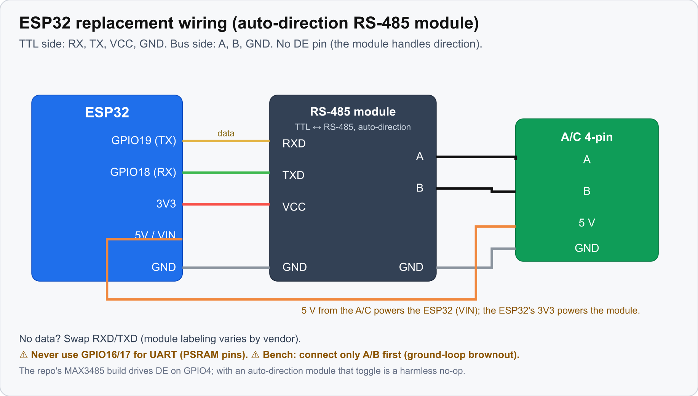
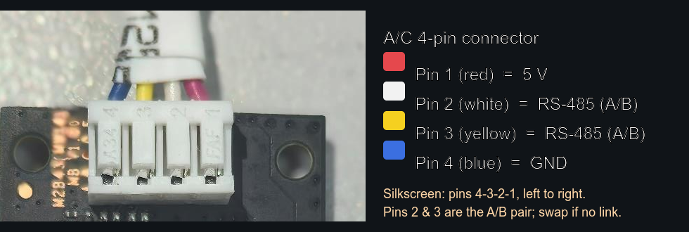

# ESP32 Matter Build

The second firmware track: an **ESP32 + RS-485 transceiver** that replaces the AmebaZ2 module,
reusing the driver unchanged. This page is the full user-facing description; the source
directory's `firmware/esp32-matter/README.md` holds only code-level notes.

← back to [Home](Home) · siblings: [Repo Map and Build Pipeline](Repo-Map-and-Build-Pipeline) ·
[Protocol Overview](Protocol-Overview) · [Testing and QA](Testing-and-QA)

---

## Why it exists

The W41H1 (RTL8710C) modules **die easily** (ESD / handling, a dead module is a common
failure) and are **hard to source in the EU**. The *protocol* is the hard part, and it's already
done and validated. An ESP32 that speaks the same bus bytes **is** a W41H1 to the mainboard:
there is no Hisense auth on the wire, only the RS-485 handshake the driver already emulates. So
this track swaps the radio/SoC and keeps the driver.

## The driver is the shared heart (reused UNCHANGED)

The ESP32 app **compiles the AmebaZ2 driver directly**. Its CMake pulls in
`../../../src/rs485-driver/hisense_rs485.cpp` (compile-time coupling, not a fork). Do not fork
these:

| File | Role |
|---|---|
| `../src/rs485-driver/hisense_rs485.{h,cpp}` | codec + bus task + DE half-duplex + "77" handler; **compiles as-is** against the HAL shim |
| `../src/rs485-driver/matter_aircon_map.h` | Matter↔Hisense mapping (host-tested) |
| `../src/rs485-driver/power_estimate.h` | power estimate (clamped) |
| `../test/virtual_ac.py`, `../test/*` | bench simulator + host tests; develop against these first |

Because the driver is the same file both firmwares build, protocol fixes land once and both
tracks get them. See [Protocol Overview](Protocol-Overview).

## The HAL-shim model

The **only** platform-specific glue is `components/hisense_hal/`, an ESP-IDF implementation of
the **same** mbed-style `serial_*` / `gpio_*` surface the driver's host-test stubs define
(`../test/hal_stub.h`). Swap the HAL, keep the driver.

```
Hisense mainboard ──RS-485(A/B)── RS-485 module ──UART── ESP32 ── Matter/Wi-Fi ── Home Assistant
                                                            │
                                  (hisense_rs485.cpp, unchanged)
                                    matter_aircon_map.h ────┘→ esp-matter Thermostat+FanControl
```

`hisense_hal` presents `serial_api.h` / `gpio_api.h` / `PinNames.h` / `platform_stdlib.h` +
FreeRTOS shims so the driver's `#include`s resolve. RX is a "soft IRQ": a task blocks on the
UART event queue and calls the driver's registered `RxIrq` handler, which drains via
`serial_readable()` / `serial_getc()`, the identical contract to AmebaZ2. `main/` is the esp-matter
app: it registers the callbacks (recommission, status uplink) and maps cluster reads/writes
through `matter_aircon_map.h`. Hardware-validated on a classic **ESP32-D0WDQ6**; the ESP32-C3
SuperMini is simulator-validated (see the wiring section).

## BOM (~€5) + wiring

- **ESP32-C3 SuperMini** (Wi-Fi+BLE, spare UART, Matter-capable, small enough to sit where the
  W41H1 did), 5 V on its `5V` pin. A classic ESP32 dev board works too, 5 V on VIN.
- A **3.3 V RS-485 transceiver**: **MAX3485 / SP3485 / SN65HVD75**, with DE+RE tied to a GPIO.
  An **auto-direction** TTL↔RS-485 module also works (the driver's DE toggle is then a harmless
  no-op). **Avoid a 5 V MAX485 module**: its RO would push 5 V into the ESP32 RX and kill it.
- Power and bus come from the A/C's module connector (**5 V confirmed**).

The pin map is **per chip** and chosen automatically by `idf.py set-target` (it lives in
`components/hisense_hal/include/PinNames.h`), so there is nothing to edit when you switch boards:

| Signal | ESP32-C3 SuperMini | classic ESP32-D0WDQ6 | transceiver |
|---|---|---|---|
| TX | GPIO5 → | GPIO19 → | DI (auto-direction module: RXD) |
| RX | GPIO6 ← | GPIO18 ← | RO (auto-direction module: TXD) |
| DE | GPIO10 → | GPIO4 → | DE+RE tied (auto-direction module: not connected) |
| 3V3 / GND | 3V3 / GND | 3V3 / GND | VCC / GND |

The classic column is **hardware-validated** (live bus read, 2026-07-12). The C3 column is
**simulator-validated** (`virtual_ac.py` over a USB-TTL adapter, 2026-08-07) but has not yet
spoken to a real mainboard.

**Bus side (module ↔ A/C 4-pin):**

| RS-485 module | | A/C 4-pin |
|---|---|---|
| A | → | RS-485 A |
| B | → | RS-485 B |
| GND | → | GND |
| ESP32 5V / VIN | ← | 5 V |



*Classic ESP32 ↔ auto-direction RS-485 module ↔ A/C 4-pin bus. No data? Swap RXD/TXD (vendor
labeling varies). Never use GPIO16/17 (PSRAM pins).*

The A/C connector pinout:



## The hard-won gotchas

- **⚠️ C3: never put the UART on GPIO18/19.** On the C3 those are the USB D-/D+ lines, and on the
  SuperMini that USB port is the only way to flash it or see its console.
- **⚠️ C3: fit a ~10k pulldown on DE (GPIO10).** DE floats from power-on until `gpio_init()` runs,
  and a DE that drifts high parks a second driver on the A/C's bus. It shows up as intermittent bus
  corruption, not as an obvious wiring fault. If firmware and wiring disagree on the DE pin,
  `busstats` shows tx_bytes climbing with rx_bytes pinned at 0.
- **⚠️ Brand-new board: erase flash before the first commission** (`dev.py erase esp32 --port P`,
  or `idf.py -p P erase-flash`). A vendor test image can leave a Wi-Fi config in NVS that makes
  every commissioning attempt fail with `CHIP Error 0x000000AC`. Never erase a commissioned node.
- **⚠️ Never use GPIO16/17 for UART on a WROVER/D0WDQ6 module**: they're bonded to the PSRAM
  die and dead as I/O *even with SPIRAM disabled*. TX-on-17 cost a whole "RX=0 but internal
  loopback passes" debugging session (internal loopback bypasses the pads). Bench tip: prove the
  pins with a bare GPIO19→GPIO18 jumper (RX must track TX) *before* wiring the transceiver.
- **⚠️ Ground loop / brownout**: while the ESP32 is USB-powered (bring-up stage 2), connect
  **only A/B** to the A/C. Routing the mains-earthed A/C GND to the laptop-earthed ESP32 browns
  it out (RTCWDT resets, flash-read errors). A/C GND/5V only join at stage 3 (powered from the
  connector, no laptop).

Code-level traps (the ESP-IDF task stack unit, DE-release timing, why a new board's NVS breaks
commissioning) are in `firmware/esp32-matter/README.md`. The envelope device-type bytes are
explained in [Protocol Overview](Protocol-Overview#the-seqhilo-bytes-are-a-device-type-not-a-session-token).

## Staged bring-up (never leave the A/C in an unknown state)

1. **Bench, no A/C**: run the host tests (`dev.py test esp32`), then flash `smoketest/` (the
   `busmon` bus monitor) and drive it with `virtual_ac.py` on a USB adapter (`dev.py bench esp32`,
   wiring and passing output in [Build, Flash & Test](Build-Flash-Test#bench-stage-no-ac)).
2. **Real bus, USB-powered**: remove the module, tap **A/B only** (ground-loop warning), poll
   with `busmon` (~1 Hz). The mainboard replies with valid, checksum-passing status frames that
   the driver decodes unchanged. This proves the **read** direction.
3. **Full integration**: power from the connector's 5 V, close it up.

Both directions are **hardware-proven** on the classic board: the mainboard accepts a non-Hisense
module and the link comes up with the device-type bytes learned from the A/C (read), and a live
ESP32 node drives real Matter commands to the A/C in production (write/control).

## Build

The guided way, with ESP-IDF v5.5.4 and esp-matter fetched at the pinned versions if you don't have
them ([Build, Flash & Test](Build-Flash-Test#esp32-esp-matter) has the detail):

```
python3 firmware/scripts/dev.py walk esp32 --board c3        # or --board classic
```

By hand, from `firmware/esp32-matter/`:

```
. $IDF_PATH/export.sh && . $ESP_MATTER_PATH/export.sh
idf.py set-target esp32c3 && idf.py build flash monitor   # esp32 for the classic board
```

That is a development build. Images that go out over OTA come from `dev.py ota esp32 release`
(which runs `esp32-release.sh`), which archives the delta base first ([OTA Updates](OTA-Updates#esp32-delta-ota)).

## Status & remaining work

The ESP32 esp-matter node has **functional and structural parity with the AmebaZ2 build**: the
same endpoints (Room A/C with OnOff, Thermostat, FanControl and power measurement; outdoor and coil
temperature; Eco / Quiet / Turbo switches; Sleep mode select; aux-heat contact sensor), commissioned
into Home Assistant on a live unit and updated over Matter delta OTA.

Known issue: the outdoor and coil temperature endpoints read null in matter-server even though the
device writes correct values every poll, a suspected esp-matter dynamic-endpoint reporting quirk
under investigation. Open work is tracked in the project's issue tracker (`esp32-path` label).
