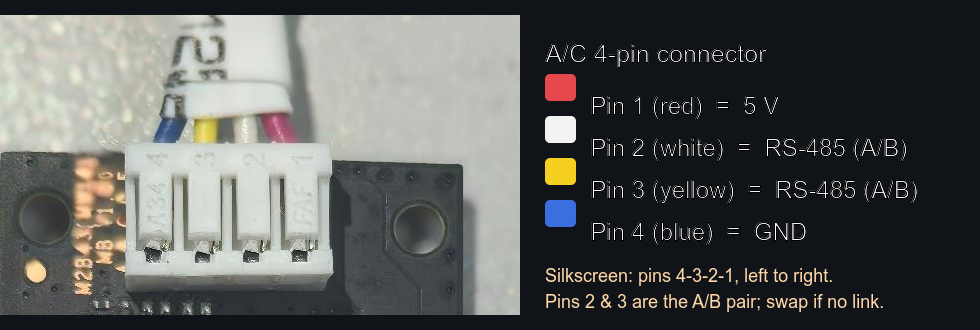
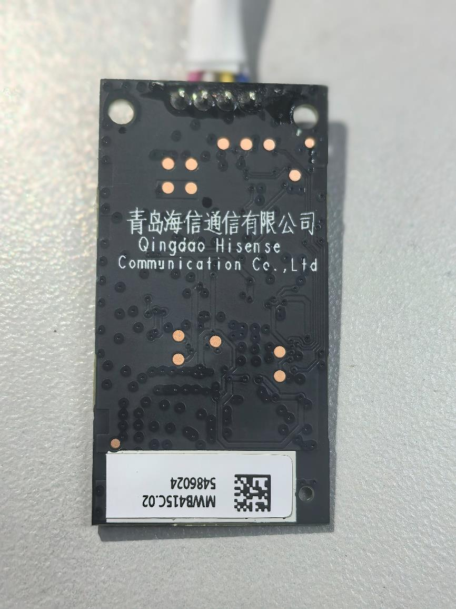

# Hardware & Wiring

The AEH-W41H1 is a sealed plastic dongle that plugs into the A/C indoor unit through a **4-pin
connector** carrying **5 V, GND, and an RS-485 A/B pair**. Under an RF shield can sits the Wi-Fi
SoC and its external flash; the RS-485 transceiver is outside the shield next to the cable
connector.

Depth: `reverse-engineering/docs/01-hardware.md`
and `reverse-engineering/hardware/pinouts.md`.

## What's on the board

*RF shield removed; ① 4-pin A/C connector ② RS-485 transceiver ③ SPI flash (clip here) ④ RTL8710C SoC. Photo: FCC ID 2AGCCAEH-W41H1, public record.*

| Part | Detail |
|---|---|
| Wi-Fi SoC | Realtek **RTL8710C (AmebaZ2)**, ARM Cortex-M, FreeRTOS. Secure boot **OFF**. Runs Wi-Fi + BLE (Matter commissioning) + the Matter stack + the RS-485 driver. |
| Flash | GigaDevice **GD25Q32(B)**: 4 MB SPI NOR, SOIC-8, JEDEC ID `C8 40 16`. Two firmware slots (OTA1 + OTA2) + a KV/FTL config partition near the top of flash. |
| RS-485 transceiver | Union Semiconductor **UM3352E**, MAX485-compatible, 8-pin SOIC. The A/C communication path. |

## A/C bus (RS-485)

- The module talks to the A/C mainboard over **UART0** at **9600 8N1**, half-duplex, no DE/RE
  handshake in the driver. On the SoC: **TX = PA_14, RX = PA_13**; the log console is on PA_16.
- On the UM3352E transceiver, bus **A/B are pins 6/7** to the mainboard; **RO (pin 1)** is received
  bytes (A/C → dongle) and **DI (pin 4)** is transmitted bytes (dongle → A/C) at logic level. Both
  are handy sniff points. Bus logic is likely 5 V; level-shift to 3.3 V before a 3.3 V-only
  adapter.

## The 4-pin A/C port

Carries **5 V · GND · RS-485 A · RS-485 B**. Power comes from the A/C; a bench supply tends to brown
out the radio, so power the module from the unit. This is where an **ESP32** replacement connects
(see [ESP32 Replacement Build](ESP32-Replacement-Build)).

The board silkscreens the pins **4-3-2-1** left to right: **pin 1 = 5 V** (red), **pins 2 and 3 = the
RS-485 A/B pair** (white, yellow), **pin 4 = GND** (blue). A and B are interchangeable at wiring time;
if the bus will not link, swap them. Confirm the colors against your own unit before you power
anything.

## Flash access (first flash / recovery)

The GD25Q32 is fully dumpable and writable with a **CH341A programmer + SOIC-8 clip** (pin 1 = dot
corner). In-circuit reads often fail because the SoC back-powers/contends the bus. Lift the flash
or hold the SoC in reset if you see `0xFF`/no-device. After the first CH341A flash, everything else
is wireless (OTA). See [Recovery & Reflash](Recovery-and-Reflash).

*The board's underside carries the model marking (FCC ID 2AGCCAEH-W41H1, public record).*

> ⚠️ The common black CH341A drives SPI at ~5 V even in "3.3 V" mode, a hazard for 3.3 V flash.
> Use a 3.3 V-modded board or a level adapter.

## Ready to flash?

Once you can see the flash chip and have the clip wired, follow
[Installing the Custom Firmware](Installing-Custom-Firmware). It covers both the no-clip Matter-OTA
path and the CH341A path end to end.
