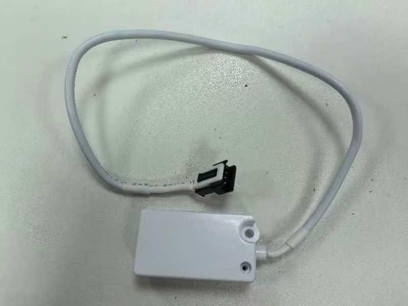
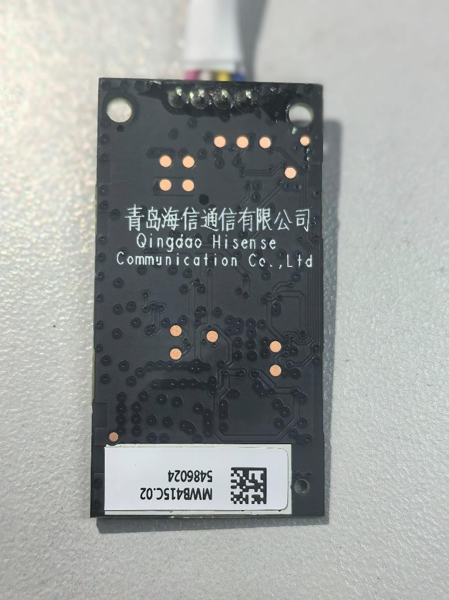

# Hardware & Wiring

The AEH-W41H1 is a sealed plastic dongle that plugs into the A/C indoor unit through a **4-pin
connector** carrying **5 V, GND, and an RS-485 A/B pair**. Under an RF shield can sits the Wi-Fi
SoC and its external flash; the RS-485 transceiver is outside the shield next to the cable
connector.

Depth: `reverse-engineering/docs/01-hardware.md`
and `reverse-engineering/hardware/pinouts.md`.

## What's on the board

*RF shield removed; ① 4-pin A/C connector ② RS-485 transceiver ③ SPI flash (clip here) ④ RTL8710C SoC. Photo: FCC ID 2AGCCAEH-W41H1, public record.*

| Part | Detail |
|---|---|
| Wi-Fi SoC | Realtek **RTL8710C (AmebaZ2)**, ARM Cortex-M, FreeRTOS. Secure boot **OFF**. Runs Wi-Fi + BLE (Matter commissioning) + the Matter stack + the RS-485 driver. |
| Flash | GigaDevice **GD25Q32(B)**: 4 MB SPI NOR, SOIC-8, JEDEC ID `C8 40 16`. Two firmware slots (OTA1 + OTA2) + a KV/FTL config partition near the top of flash. |
| RS-485 transceiver | Union Semiconductor **UM3352E**, MAX485-compatible, 8-pin SOIC. The A/C communication path. |

## A/C bus (RS-485)

- The module talks to the A/C mainboard over **UART0** at **9600 8N1**, half-duplex. On the SoC:
  **TX = PA_14, RX = PA_13, DE = PA_17** (the driver raises DE around every transmit, as the stock
  firmware does); the log console is on PA_16. See [Protocol Overview](Protocol-Overview#physical-layer).
- On the UM3352E transceiver, bus **A/B are pins 6/7** to the mainboard; **RO (pin 1)** is received
  bytes (A/C → dongle) and **DI (pin 4)** is transmitted bytes (dongle → A/C) at logic level. Both
  are handy sniff points. Bus logic is likely 5 V; level-shift to 3.3 V before a 3.3 V-only
  adapter.

## The 4-pin A/C port

Carries **5 V · GND · RS-485 A · RS-485 B**. Power comes from the A/C; a bench supply tends to brown
out the radio, so power the module from the unit. This is where an **ESP32** replacement connects
(see [ESP32 Replacement Build](ESP32-Replacement-Build)).

The board silkscreens the pins **4-3-2-1** left to right: **pin 1 = 5 V** (red), **pins 2 and 3 = the
RS-485 A/B pair** (white, yellow), **pin 4 = GND** (blue). A and B are interchangeable at wiring time;
if the bus will not link, swap them. Confirm the colors against your own unit before you power
anything.

## Replacing the module with an ESP32

The ESPHome build (recommended) and the ESP32 Matter build both drop the W41H1 entirely and plug an
ESP32 into the same 4-pin port. Parts, about €5 in total:

| Part | Pick | Notes |
|---|---|---|
| ESP32 board | **ESP32-C3 SuperMini** (small enough for the module bay), or a classic ESP32 dev board | powered from the port's 5 V |
| RS-485 transceiver | a **3.3 V** part: MAX3485, SP3485 or SN65HVD75, or a 3.3 V auto-direction TTL to RS-485 module | **never a 5 V MAX485 module**: its RO pin drives 5 V into the ESP32 and kills the RX pin |
| C3 only | a ~10 kΩ pulldown resistor on DE (GPIO10) | stops a floating DE from jamming the bus at power-up |
| Wiring | a 4-pin lead to the A/C port, jumper wires | A and B are interchangeable; swap them if the bus will not link |

*Classic ESP32 ↔ auto-direction RS-485 module ↔ A/C 4-pin bus. The C3 SuperMini uses TX 5 / RX 6 /
DE 10.*

Full pin tables for both boards, and the GPIO pins you must avoid, are in
[ESP32 Replacement Build](ESP32-Replacement-Build#bom-5--wiring). Two rules protect the hardware
while you work:

- **While the board is on USB, connect only A and B** to the A/C. Joining the A/C's mains-earthed
  GND to a laptop-earthed board browns it out. GND and 5 V go on once the laptop is unplugged.
- Bench-test with no A/C first: [Build, Flash & Test](Build-Flash-Test#bench-stage-no-ac).

## Flash access (AmebaZ2 first flash / recovery)

The GD25Q32 is fully dumpable and writable with a **CH341A programmer + SOIC-8 clip**. After the
first CH341A flash, everything else is wireless (OTA). Clip wiring, the in-circuit read problem and
the CH341A voltage warning are in [Recovery & Reflash](Recovery-and-Reflash#use-the-clip-tooling-not-flashrom).

*The board's underside carries the model marking (FCC ID 2AGCCAEH-W41H1, public record).*

## Ready to flash?

- **ESP32 board wired up:** follow the [User Guide](User-Guide), which starts with the ESPHome build.
- **Keeping the stock module:** once you can see the flash chip and have the clip wired, follow
  [Installing the Custom Firmware](Installing-Custom-Firmware). After that first write, updates go
  over Matter OTA.
