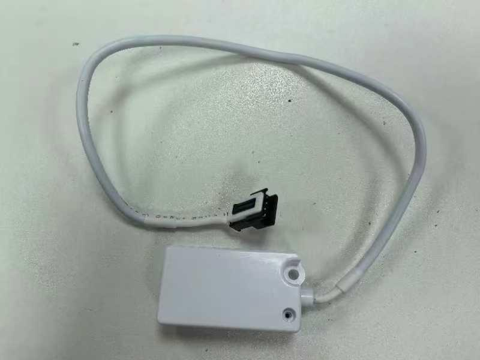
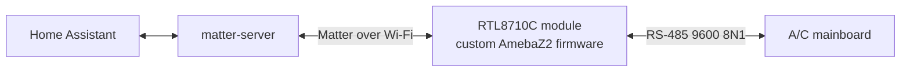

# Hisense AEH-W41H1: de-cloud with custom Matter firmware

Drop the ConnectLife cloud from a Hisense **`AEH-W41H1`** A/C Wi-Fi module (Realtek **RTL8710C /
AmebaZ2**) and run the A/C from Home Assistant with no cloud. Custom **Matter** firmware on the
module bridges Matter attributes to the A/C's internal **RS-485** bus (9600 8N1). The framing and
every byte offset are hardware-confirmed against a real unit.

*The module: a small board in a white housing on a 4-pin cable to the indoor unit. (Photo: FCC ID
2AGCCAEH-W41H1, public record.)*

> Not affiliated with Hisense, Realtek, or the CSA. The firmware uses Matter **test** credentials,
> so it is for development and personal use: uncertified, not for sale. A bad flash can brick the
> module (recoverable from a stock dump). Do this at your own risk.

## Status

- **AmebaZ2 module (primary track):** the custom Matter `room_air_conditioner` firmware runs on
  hardware. You convert a module by clip-flashing or over the air (no disassembly). Updates ship
  over Matter OTA.
- **ESP32 + RS-485 (replacement track):** when the original module dies, an ESP32 board replaces the
  dongle on the same 4-pin bus. The esp-matter node builds end-to-end and sits in bench bring-up.

## How it works

## Start here

| Page | What |
|---|---|
| **[Installing the Custom Firmware](Installing-Custom-Firmware)** | **the two ways to flash a stock module: OTA (recommended) or CH341A clip** |
| [Hardware & Wiring](Hardware-and-Wiring) | the module, SoC/flash/transceiver, the A/C 4-pin port, the RS-485 bus |
| [Commissioning & HA Setup](Commissioning-and-HA-Setup) | commission into HA via matter-server, the cross-VLAN mDNS fix, re-interview after an OTA |
| [Everyday Control](Everyday-Control) | what entities appear, the unified climate integration, special modes, the dashboard card |
| [OTA Updates](OTA-Updates) | ship a new firmware, retry reality, version rules |
| [Recovery & Reflash](Recovery-and-Reflash) | CH341A SPI-clip recovery, the stock image, preserving commissioning |
| [FAQ & Gotchas](FAQ-Gotchas) | the load-bearing traps, in Q&A form |

## Developer guides

| Page | What |
|---|---|
| [Repo Map & Build Pipeline](Repo-Map-and-Build-Pipeline) | where code lives, the SDK-outside-the-repo model, build/flash pipeline |
| [Protocol Overview](Protocol-Overview) | the RS-485 A/C protocol, framing, the Matter↔Hisense mapping |
| [Testing & QA](Testing-and-QA) | no-hardware host tests, the virtual A/C simulator, the HIL gate |
| [ESP32 Replacement Build](ESP32-Replacement-Build) | the ESP32 + RS-485 replacement track |

---

This wiki is the guide. Read it first. The `firmware/docs/` and `reverse-engineering/docs/` files in
the repository hold the deep reference: design rationale, byte-level protocol, HIL notes. Each page
links to the one it draws from.
