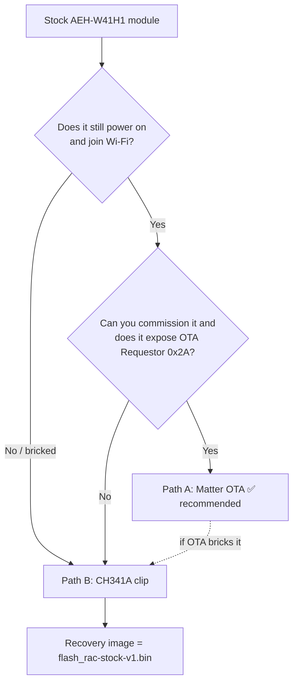
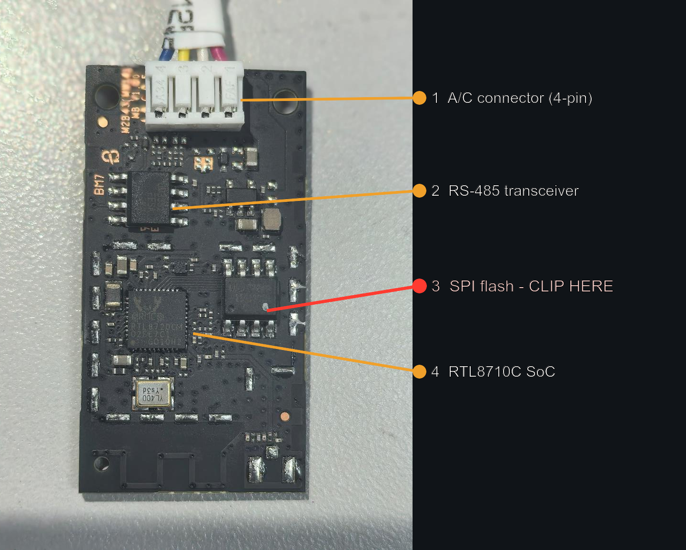
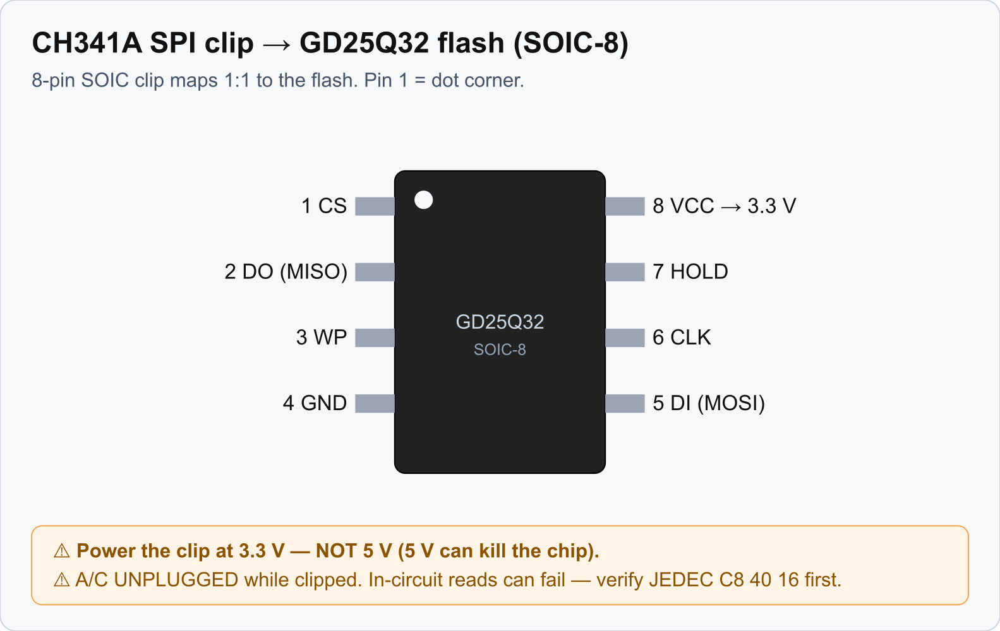

# Installing the custom firmware: two paths

You get the custom Matter firmware onto a **stock** AEH-W41H1 module two ways. Both land in the same
place, an uncertified Matter A/C you commission into Home Assistant. They differ in how the bytes
reach the flash.

| | **Path A: Matter OTA** | **Path B: CH341A clip** |
|---|---|---|
| Disassembly | None; the module stays in the A/C | Open the A/C, pull the module, clip the flash |
| Hardware needed | A laptop with Wi-Fi and Bluetooth | CH341A programmer and a SOIC-8 clip |
| Risk | Low (worst case: retry) | **ESD can kill the module** while you handle it |
| Works when… | the stock module still **commissions** and exposes a Matter OTA Requestor | **always**, even on a bricked or non-commissionable module |
| Verdict | ✅ **Recommended; try this first** | Fallback and recovery |

> The module is fragile. Clip cycles and handling have killed modules by ESD. Prefer the OTA path
> so you never open the unit.

## Which path?

New to the hardware? Read **[Hardware & Wiring](Hardware-and-Wiring)** first.

---

## Path A: convert over the air (recommended)

No clip, no disassembly. The stock firmware is a barely-customized Matter example. It runs a live,
commissionable Matter interface and an OTA Requestor cluster (`0x2A`). So you commission it, hand it
the new image over Matter OTA, and it writes and boots the image on its own. The partition layout
matches because the custom firmware builds on the same SDK.

**You need** a host with `chip-tool` and `chip-ota-provider-app` built from the pinned
`connectedhomeip`, the current `.ota` image, and a laptop that can join the A/C's IoT Wi-Fi within
BLE range of the unit. **`firmware/scripts/ota_convert_stock.sh`** automates the whole flow;
**`firmware/docs/12-ota-convert-stock-unit.md`** explains the why.

**Steps:**

1. **Put your laptop on the device's L2.** Join the Wi-Fi/VLAN the module will use. Cross-VLAN IPv6
   mDNS fails for commissioning and for the OTA.
2. **Open the stock pairing window:** press **"77"** on the A/C (swing ×6).
3. **Commission with attestation bypass.** The stock certs don't cross-reference, so a normal
   controller rejects them. Use `chip-tool --bypass-attestation-verifier 1` (stock passcode
   `20202021`). Retry once if the last handshake returns a transient failure.
4. **Confirm it can OTA.** Read the descriptor server-list and check for cluster **42**
   (`OtaSoftwareUpdateRequestor`). No cluster 42 means stop and switch to **Path B**.
5. **Repackage the `.ota`** with `ota_image_tool.py` so its header vid/pid matches the stock target
   (the stock module reports VID `5004` / PID `13825`), keeping `min ≤ curVer ≤ max`.
6. **Serve and drive the OTA.** Run `chip-ota-provider-app`, commission it as a node, grant ACL, set
   it as the device's default provider, then `announce-otaprovider`. Watch for
   `QueryImage → UpdateAvailable → BDX blocks → ApplyUpdateRequest`. The unit reboots into the custom
   firmware.
7. **Commission into Home Assistant.** The custom firmware passes attestation with no bypass. Press
   "77", then add it in HA (see **[Commissioning & HA Setup](Commissioning-and-HA-Setup)**).

The result matches a clip-flashed unit, with zero physical access.

---

## Path B: CH341A SPI clip

A direct write to the flash chip. Use it when the module won't commission or is bricked, when you
want an offline install, or to recover from a bad OTA.

**You need** a **CH341A** USB programmer, a **SOIC-8 test clip**, the A/C opened, and the module out
(or at least the flash reachable). The chip to clip is the 8-pin SPI flash:

*(RF shield removed. Photo: FCC ID 2AGCCAEH-W41H1, Internal Photos exhibit, public record.)*

**Wiring.** The SOIC-8 clip maps 1:1 to the flash pins. Pin 1 is the dot/dimple corner:

**Flashing.** Use the project flasher. On this chip `flashrom` does partial writes with no error, so
avoid it:

- **`firmware/flasher/ch341flash.py`**: region write `0x0–0x140000`. It preserves the Matter
  commissioning data stored higher in flash (`0x2FF000+`), so you power-cycle after the write with
  no re-commission.
- **`firmware/flasher/ch341flash-full.py`**: whole-chip write, for a first conversion or a full
  recovery. It erases commissioning data, so you re-commission afterward.
- **`firmware/flasher/ch341dump.py`**: back up the whole chip first. Dump before every write; that
  dump is your only way back to stock.

Write the `flash_rac-integrated-*.bin` image, unclip, power-cycle. Full detail lives in
**`firmware/docs/10-firmware-ota-procedure.md`** and **[Recovery & Reflash](Recovery-and-Reflash)**.

> ⚠ Power the clip at **3.3 V, never 5 V**. ⚠ Keep the A/C **unplugged** while clipped. In-circuit
> reads can fail because the SoC contends the bus, so you may have to lift the flash chip.

---

## After either path

- **Updating** an already-custom unit is pure Matter OTA (see **[OTA Updates](OTA-Updates)**).
- **Bricked it?** Flash `flash_rac-stock-v1.bin` with Path B to return to stock (see
  **[Recovery & Reflash](Recovery-and-Reflash)**).
- If the original module is **dead**, replace it with an ESP32 (see
  **[ESP32 Replacement Build](ESP32-Replacement-Build)**).
