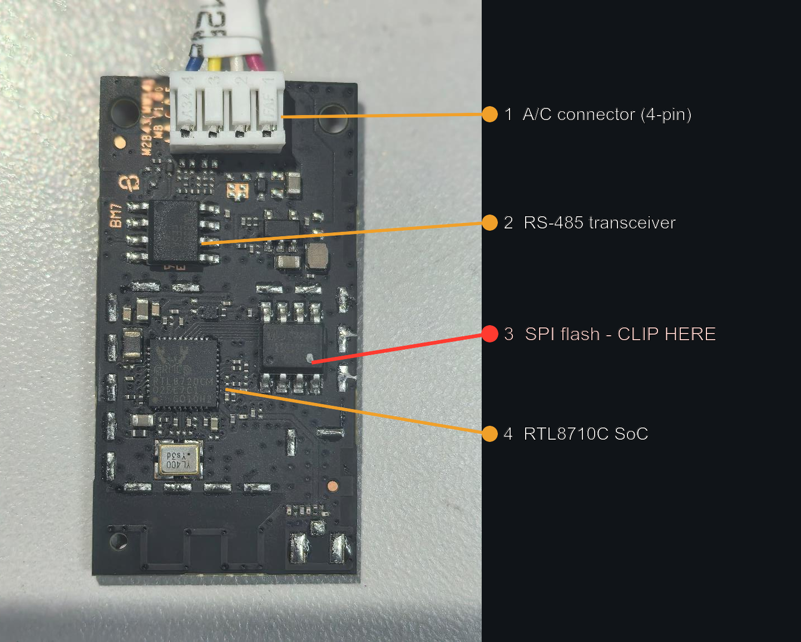
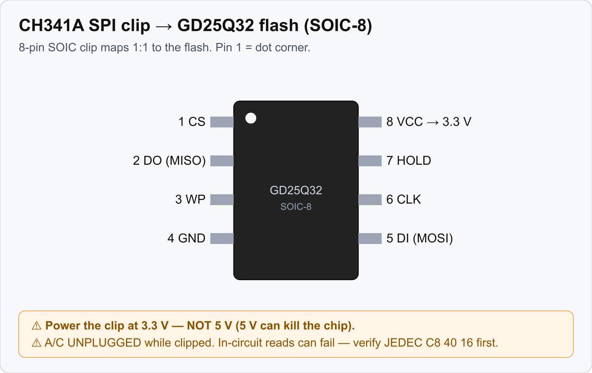

# Installing the custom firmware

You get the custom Matter firmware onto a **stock** AEH-W41H1 module by writing it to the module's
SPI flash with a CH341A programmer. The result is an uncertified Matter A/C you commission into
Home Assistant.

New to the hardware? Read **[Hardware & Wiring](Hardware-and-Wiring)** first.

> The module is fragile. Clip cycles and handling have killed modules by ESD. Work carefully, keep
> the A/C unplugged while clipped, and back up the stock flash before you write.

---

## CH341A SPI clip

A direct write to the flash chip.

**You need** a **CH341A** USB programmer, a **SOIC-8 test clip**, the A/C opened, and the module out
(or at least the flash reachable). The chip to clip is the 8-pin SPI flash:

*(RF shield removed. Photo: FCC ID 2AGCCAEH-W41H1, Internal Photos exhibit, public record.)*

**Wiring.** The SOIC-8 clip maps 1:1 to the flash pins. Pin 1 is the dot/dimple corner:

**Flashing.** Use the project flasher. On this chip `flashrom` does partial writes with no error, so
avoid it:

- **`firmware/flasher/ch341flash.py`**: region write `0x0–0x140000`. It preserves the Matter
  commissioning data stored higher in flash (`0x2FF000+`), so you power-cycle after the write with
  no re-commission.
- **`firmware/flasher/ch341flash-full.py`**: whole-chip write, for a first install or a full
  recovery. It erases commissioning data, so you re-commission afterward.
- **`firmware/flasher/ch341dump.py`**: back up the whole chip first. Dump before every write; that
  dump is your only way back to stock.

Write the `flash_rac-integrated-*.bin` image, unclip, power-cycle. Full detail lives in
**`firmware/docs/10-firmware-ota-procedure.md`** and **[Recovery & Reflash](Recovery-and-Reflash)**.

> ⚠ Power the clip at **3.3 V, never 5 V**. ⚠ Keep the A/C **unplugged** while clipped. In-circuit
> reads can fail because the SoC contends the bus, so you may have to lift the flash chip.

---

## After install

- **Updating** an already-custom unit is pure Matter OTA (see **[OTA Updates](OTA-Updates)**).
- **Bricked it?** Flash `flash_rac-stock-v1.bin` to return to stock (see
  **[Recovery & Reflash](Recovery-and-Reflash)**).
- If the original module is **dead**, replace it with an ESP32 (see
  **[ESP32 Replacement Build](ESP32-Replacement-Build)**).
